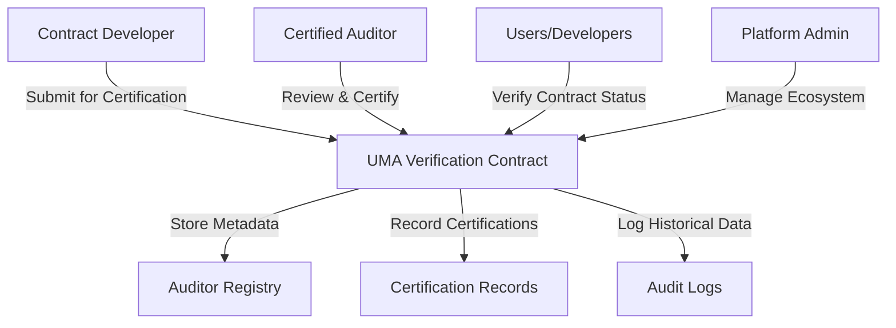

# UMA Emulator: Smart Contract Verification Platform

A decentralized smart contract verification and certification platform built on the Stacks blockchain, providing transparent and trustworthy contract assessments through a robust auditor network.

## Overview

UMA Emulator offers a comprehensive framework for:
- Verifying smart contract integrity
- Managing qualified auditor registrations
- Tracking detailed certification histories
- Enabling transparent contract verification
- Creating immutable audit trails

Our platform bridges the trust gap between contract developers, auditors, and users by providing verifiable, standardized contract certifications.

## Architecture



### Core Components
- **Auditor Registry**: Manages and validates professional auditors
- **Certification Engine**: Processes and issues contract certifications
- **Verification Mechanism**: Provides real-time contract status queries
- **Audit Logging**: Maintains comprehensive, immutable certification records

## Getting Started

### Prerequisites
- Stacks blockchain access
- Clarinet development environment
- Web3 wallet

### Basic Usage

1. **Request Contract Certification**
```clarity
(contract-call? 
  .uma-verification 
  request-contract-certification 
  contract-principal 
  "1.0.0" 
  "Detailed contract description" 
  "https://github.com/your-contract-repo")
```

2. **Verify Contract Status**
```clarity
(contract-call? 
  .uma-verification 
  verify-contract-status 
  contract-principal 
  "1.0.0")
```

## Development

### Installation
1. Clone the repository
2. Install dependencies
3. Configure Clarinet
4. Deploy contracts

### Testing
```bash
clarinet test
```

## Security Considerations

### Best Practices
- Always verify contract certification before interaction
- Review auditor trust scores
- Check certification validity periods
- Use comprehensive verification endpoints

### Limitations
- Certifications have time-bound validity
- Auditor trust scores can fluctuate
- Certification doesn't guarantee absolute security
- Relies on auditor network quality

### Risk Mitigation
- Encourage multiple independent audits
- Implement periodic recertification
- Monitor auditor performance
- Analyze comprehensive audit logs

## Contributing
- Follow our contribution guidelines
- Submit detailed pull requests
- Participate in code reviews

## License
[Specify your license here]

## Contact
UMA Development Team
dev@uma.xyz